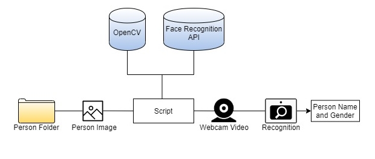
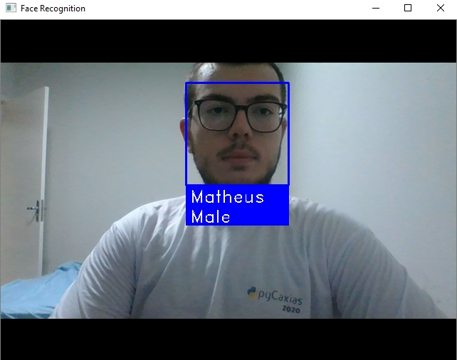
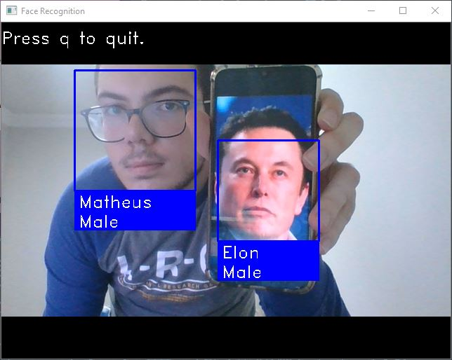

<h1 align="center">Webcam Face and Gender Recognition</h1>

This Python scripts aims to recognize persons and his genders. It works with OpenCV and Face Recognition API. By Face Recognition a person is predicted and the gender is estimated using Deep Neural Network from Open CV. The script shall analise one image inside a specific folder (with one or n persons), and will return the 128-dimension face encoding for each face in the image. After it predict the gender using the neural network.</b>

<h2>Requirements</h2>
<ul>
    <h3>I run the code in this config:</h3>
    <ul>
        <li>Python 3.6.10</li>
        <li>OpenCV 4.2.0</li>
        <li>Face Recognition 1.2.3</li>
        <li>Dlib 19.8.1</li>
        <li>Numpy 1.18.1</li>
    </ul>
    <h3>You can get here:</h3>
    <li>
        <a href="https://www.python.org/downloads/">Python 3.6</a>
    </li> 
    <li>
        <a href="https://docs.opencv.org/master/d6/d00/tutorial_py_root.html">OpenCV</a>
        <pre><code>pip install opencv-python</code></pre>
    </li>
    <li>
        <a href="https://github.com/ageitgey/face_recognition">Face Recognition</a>
        <pre><code>pip install face_recognition</code></pre>
    </li>
    <li>
        <a href="http://dlib.net/">Dlib</a>
        <pre><code>pip install dlib</code></pre>
        
If you are in Windows and the first method does not do, try this:

        <pre><code>python -m pip install https://files.pythonhosted.org/packages/0e/ce/f8a3cff33ac03a8219768f0694c5d703c8e037e6aba2e865f9bae22ed63c/dlib-19.8.1-cp36-cp36m-win_amd64.whl#sha256=794994fa2c54e7776659fddb148363a5556468a6d5d46be8dad311722d54bfcf</code></pre>
    </li>
    <li>
        <a href="https://numpy.org/doc/">NumPy</a>
        <pre><code>pip install numpy</code></pre>
    </li>
    <li>
        <a href="https://matplotlib.org/3.2.1/contents.html">Matplotlib(optional)</a>
    <pre><code>pip install matplotlib</code></pre>
    </li>
</ul>
<h2>How to run?</h2>

 First of all, you must put the photos of people in the "persons" folder, the image file must have the person's name. For example, if I wanted Elon Musk to be recognized, I would have to put a photo of him in the persons folder with the file name "Elon Musk". It is essential that the file name is the way the program should call the person. 

 After that you can just run the script inside the project's folder: 

<pre> <code>
     python webcam-face-recognition.py
</code> </pre>

 This will open a window called Face Recognition, which will recognize and distinguish people according to the photos in the persons folder. If you want to close the window just press <b>"q"</b>.

<h2>Examples:</h2>
<h3>One person recognitions</h3>

<h3>Two persons recognitions</h3>

<h2>Questions or Issues</h2>

If you have any question or are getting any issue, contact-me.

<a href="mailto:matheuzhenrik@gmail.com">E-mail</a> 
<a href="www.linkedin.com/in/matheuskolln">LinkedIn</a>