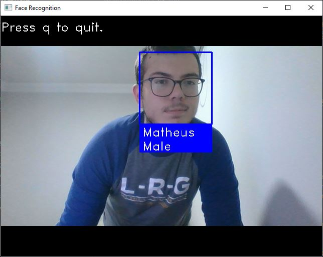

<h1 align="center">Webcam Face and Gender Recognition</h1>

A Python script who works with OpenCV and Face Recognition to recognize persons and his genders. The person are predicted by Face Recognition, an API for this (obviously), and the gender are predicted by one method from Deep Neural Network from Open CV, who receives an Neural Network. The script will analyse one image in the folder of person (you can have n persons), and he will return the 128-dimension face encoding for each face in the image, after this he will go to predict the gender with the neural network, we have three arrays of importants data:</b>

<ol>
    <li>
        <h3>known_face_encodings:</h3>
        <pre><code>
known_face_encodings = [
    person1_face_encoding,
    person2_face_encoding
]</code></pre>
            
This array will contain the face_encodings, who will used to comparison with the webcam video

    </li>
    <li>
        <h3>known_face_names:</h3>
        <pre><code>known_face_names = [
    "Person 1 Name",
    "Person 2 Name"
]</code></pre>
            
This array will contain the name of persons, they are the target of model.

    </li>
    <li>
        <h3>known_gender:</h3>
        <pre><code>known_gender = [
    person1_gender,
    person2_gender
]</code></pre>
            
This array will contain the genders of persons, they are predicted by the function <b>predictGender()</b>

    </li>
</ol>

With this three arrays the script can make comparisons and send outputs.

 
<h2>Requirements</h2>
<ul>
    <li>
        <a href="https://www.python.org/downloads/">Python 3.3+ or 2.7</a>
    </li> 
    <li>
        <a href="https://docs.opencv.org/master/d6/d00/tutorial_py_root.html">OpenCV</a>
        <pre><code>pip install opencv-python</code></pre>
    </li>
    <li>
        <a href="https://github.com/ageitgey/face_recognition">Face Recognition</a>
        <pre><code>pip install face_recognition</code></pre>
    </li>
    <li>
        <a href="http://dlib.net/">Dlib</a>
        <pre><code>python -m pip install https://files.pythonhosted.org/packages/0e/ce/f8a3cff33ac03a8219768f0694c5d703c8e037e6aba2e865f9bae22ed63c/dlib-19.8.1-cp36-cp36m-win_amd64.whl#sha256=794994fa2c54e7776659fddb148363a5556468a6d5d46be8dad311722d54bfcf</code></pre>
    </li>
    <li>
        <a href="https://numpy.org/doc/">NumPy</a>
        <pre><code>pip install numpy</code></pre>
    </li>
    <li>
        <a href="https://matplotlib.org/3.2.1/contents.html">Matplotlib(optional)</a>
    <pre><code>pip install matplotlib</code></pre>
    </li>
</ul>
<h2>How to run?</h2>

You can run the script, putting an image to folder personX (where x are number of the person) and editing the name of this person in variable <pre><code>known_face_names</pre></code>

and setting his path to variables<pre><code>personX_image
personX_gender</code></pre>

<h3>Example: </h3>
<pre><code>
known_face_names = [
    "Matheus",
]

person1_image = face_recognition.load_image_file("./person1/matheus.JPG")
person1_face_encoding = face_recognition.face_encodings(person1_image)[0]
person1_gender = predictGender("./person1/matheus.JPG")
</code></pre>

<h2>One person recognitions</h2>

<h2>Two persons recognitions</h2>

<h2>Questions or Issues</h2>

If u have any question or are getting any issue, contact-me.

<a href="mailto:matheuzhenrik@gmail.com">E-mail</a> 
<a href="www.linkedin.com/in/matheuskolln">LinkedIn</a>